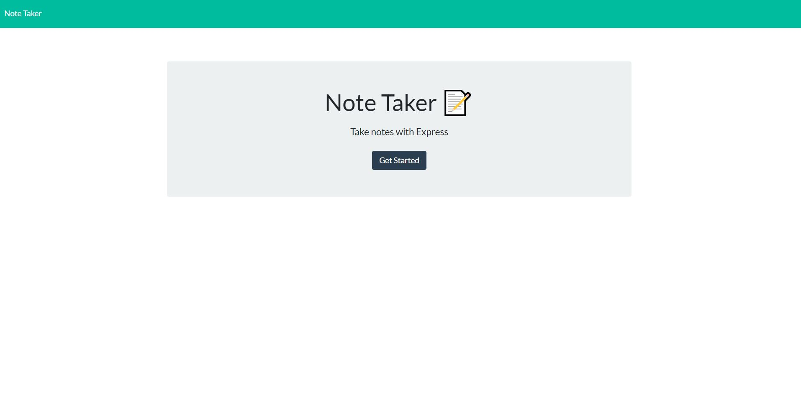
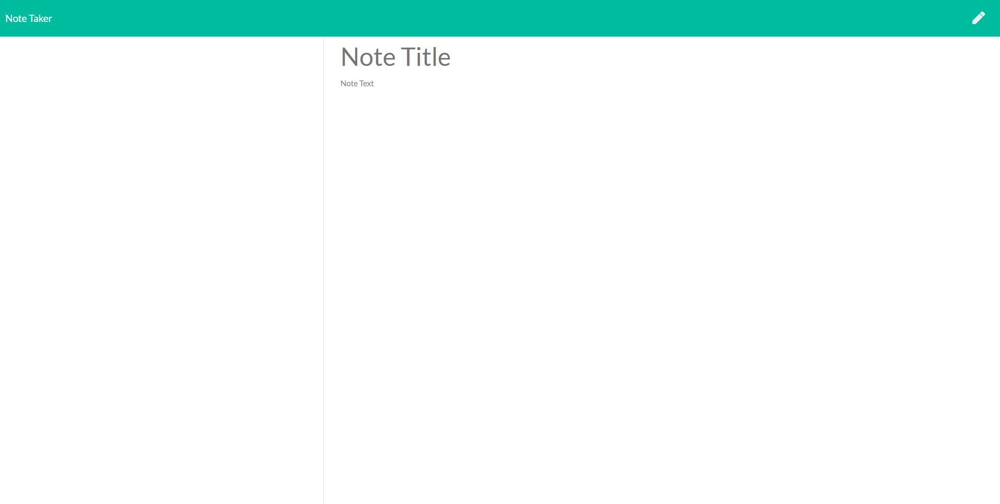

# Note-Taker


It is an application that can be used to write, save, and delete notes. This application uses express backend and retrieves, saves, and deletes notes data from a JSON file. This app is hosted using the service Heroku. 

### Table of Contents

* [Installation](#installation)
* [Hosted Site](#hosted)
* [Screenshots](#screenshots)
* [License](#license)
* [Technologies Used](#technologies%20used)
* [Questions](#questions)

### Installation
To install necessary dependencies, run the following command:
```
npm i
```
The program can then be run using the following command line in the bash terminal or integrated terminal:
```
node server.js
```
### Hosted
The app is hosted using Heroku here at this link: [Note Taker](https://mysterious-eyrie-18588.herokuapp.com/)
### Screenshots 





### License
This project is licensed under the MIT License. 

### Technologies Used:
Front End: 
* HTML
* CSS
* JavaScript

Back End:
* [Node.js](https://nodejs.org/en/)
* [Express.js](https://expressjs.com/)
* [Heorku](https://www.heroku.com)

### Questions
If you have any questions about the repo, open an issue or contact me directly at ogmdeveloper0@gmail.com. You can find more of my work through my [GitHub Account](https://github.com/ogmedina/).